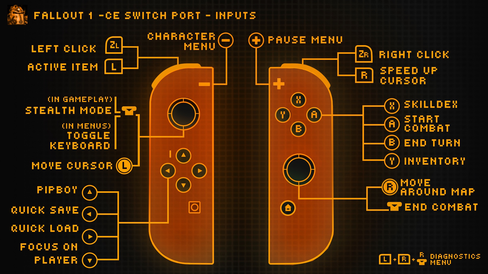

<div align="center">


# Fallout Community Edition - Switch

</div>

You must own the game to play and have a Switch capable of running **unsigned code, so you need a Switch running on custom firmware** to run the port. Needless to say, this is not an official effort from Interplay or Bethesda.

---

## Installation

1. Purchase your copy on [GOG](https://www.gog.com/en/game/fallout) or [Steam](https://store.steampowered.com/app/38400/). The files need to be from a Windows installation (I think.)
2. Download the latest [release](https://github.com/ryandeering/fallout-ce-switch/releases/latest) or build from the source. See YAML pipelines for reference.
3. Drag the installation files into a new folder called `fallout1` in your `switch` folder on the root of your SD card. You can have `fallout1` directly in the root too.
4. Create a file named `fallout1_nx.ini` in your `fallout1` folder to override defaults. **If missing, the game now creates it on first launch.**
5. Use the following content:
```ini
[MAIN]
SCR_WIDTH=1708
SCR_HEIGHT=960
SCALE_2X=1
SCALE_QUALITY=bilinear
; Change resolution and determine scaling. SCALE_2X=1 will turn 2x scaling on. SCALE_2X=0 will turn it off.
; SCALE_QUALITY can be nearest, linear, or bilinear. bilinear uses the custom scaler.

[CONTROLS]
; Use NONE, MOUSE_LEFT, MOUSE_RIGHT, HIGHLIGHT, or SDL-style key names.
; Prefix key names with HOLD: when the key should remain down while the controller input is held.
; HIGHLIGHT controls what the HIGHLIGHT action outlines: all, items, or enemies.
; Right stick controls map and world map camera scrolling directly.
HIGHLIGHT=all
A=HOLD:SPACE
B=ESCAPE
X=I
Y=MOUSE_LEFT
PLUS=A
MINUS=C
LSTICK=1
RSTICK=KP_ENTER
DPAD_UP=P
DPAD_DOWN=HOME
DPAD_LEFT=F6
DPAD_RIGHT=F7
L=B
R=HIGHLIGHT
ZL=S
ZR=MOUSE_RIGHT
```

6. Put the necessary executable in your `switch` folder on the root of your SD card, either `.nro` or `.nso`.

> **Save compatibility:** Fallout 1 **CE** saves from PC and other CE versions should usually work on Switch. This is experimental and may cause save state corruption.
>
> **Keep in mind:**
> - Some saves from different game versions or heavily modded setups may fail to load.
> - Make backups before moving saves between platforms.

## Controls

<div align="center">



</div>

- **Basic touchscreen support is implemented.**
- **Native on-screen keyboard support is implemented for saves, talking to NPCs, naming characters, changing amounts with sellers.**

## Configuration

- **Cursor Sensitivity**: Adjustable in options via mouse sensitivity.
- **Resolution**: You can configure resolution and scaling through a config file. Create a file in your `fallout1` folder called `fallout1_nx.ini` - It needs to follow the following structure. `SCALE_QUALITY` can be `nearest`, `linear`, or `bilinear`; `bilinear` uses the custom scaler.
- **Controls**: You can remap controller buttons in the `[CONTROLS]` section of `fallout1_nx.ini`. Use key names like `A`, `SPACE`, `ESCAPE`, `F6`, `HOME`, `UP`, or actions like `MOUSE_LEFT`, `MOUSE_RIGHT`, `HIGHLIGHT`, and `NONE`. `HIGHLIGHT=all|items|enemies` controls which objects are outlined while the highlight action is held. The right stick pans the local map and world map directly instead of emulating arrow keys.

## Issues

If you encounter any issues, please create an issue, and I'll look into it when I have time. Other contributors are welcome to assist in solving and fixing issues if interested.

## Questions

- **Fallout 2 wen?**

> [It's done!](https://github.com/ryandeering/fallout2-ce-switch)

## Credits

- **Interplay**: For developing and publishing the original game.
- **alexbatalov and fallout-ce Contributors**: For their excellent work in keeping this game modern.
- **Romane**: For the graphics.

Much appreciated to all.
